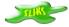

# Delta2Sliks
A C++ program to convert from the [DELTA](https://www.delta-intkey.com/) (**DE**scription **L**anguage for **TA**xonomy) to the [SLIKS](http://www.stingersplace.com/SLIKS/) (**S**tinger's **L**ightweight **I**nteractive **K**ey **S**oftware) format.

Uses the [tDelta C++ class library](https://sourceforge.net/projects/freedelta/files/deltalib/new/) for reading DELTA files written by Denis Ziegler with amendments by Guillaume Rousse, Bastiaan Wakkie, and Mauro Cavalcanti.

##### Installation

Delta2Sliks does not have any special installation procedure; Just extract the contents of the distribution package (see the [Releases](https://github.com/maurobio/delta2sliks/releases) section) to any folder. The distribution package includes pre-compiled versions for GNU/Linux and MS-Windows (64-bit only) .

##### Usage

Delta2Sliks is a command line utility, to run it just open a terminal window in the installation folder and type

delta2sliks <chars_filename> <items_filename> [specs_filename]

where <chars_filename> and <items_filename> are compulsory and specs_filename is optional (but should be used to ensure the program will find the correct character types).

The output will be files "chars.new" and "items.new" in DELTA format excluding numeric and text characters and file "data.js" containing the dataset translated into SLIKS format. See the SLIKS documentation on how to use it to create online interactive keys.